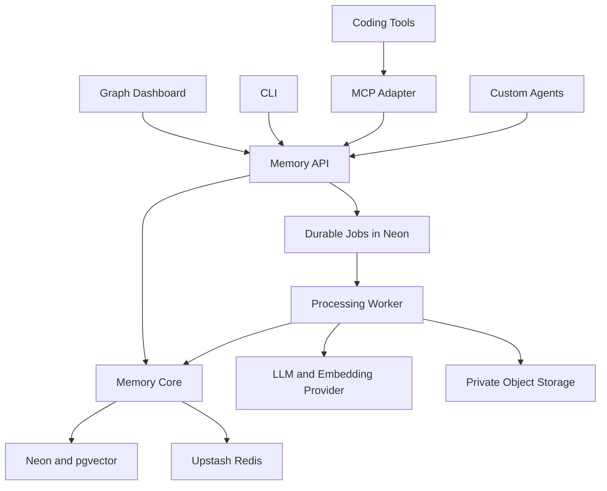
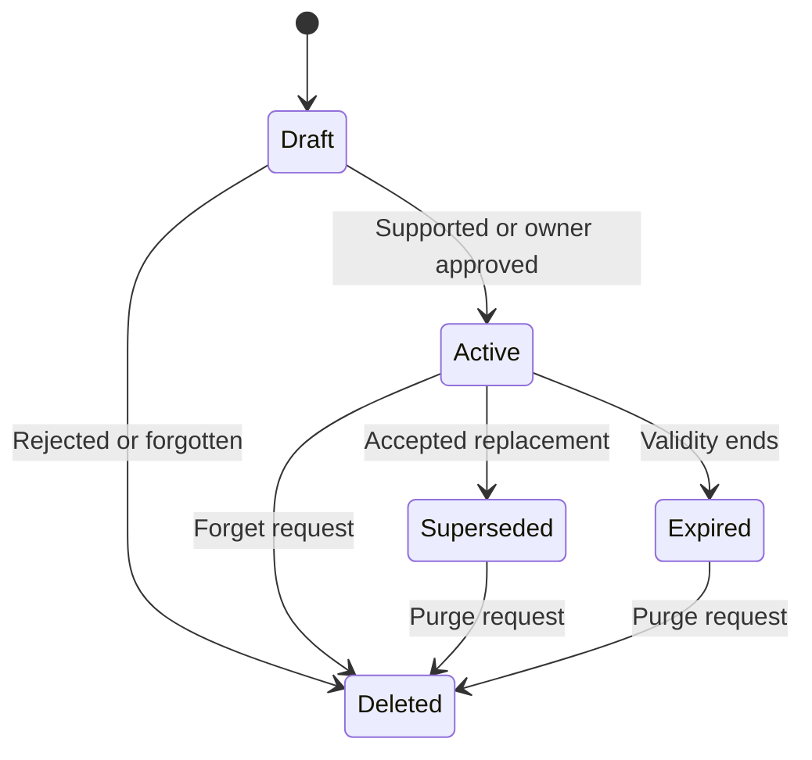
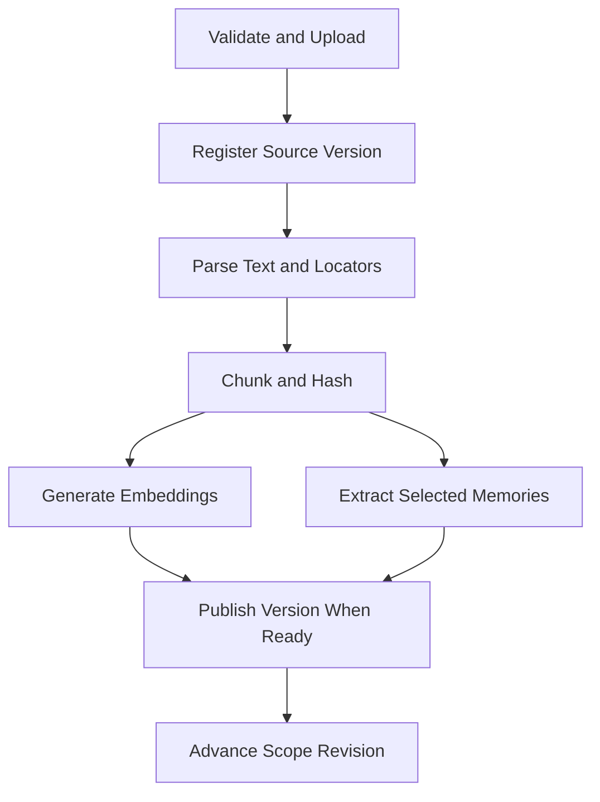

# Agent Memory Platform — V1 Core Architecture and System Design

Version: 1.0  
Design date: October 6, 2026  
Status: Implementation blueprint; no application or cloud resources have been provisioned.  
Primary use: Laww's personal assistant, agentic coding tools, and custom AI agents.

## 1. Product purpose

Build one memory service that captures useful information from conversations, selected tool results, and documents; retrieves the right context for each task; and exposes the same behavior through a visual dashboard, CLI, REST API, and MCP.

The service changes the context an agent receives. It does not train or fine-tune model weights. An existing embedding model converts text to vectors; an existing LLM can extract and summarize memories. Neither requires developing a machine-learning model.

The custom algorithms are the product: deciding what to remember, recognizing duplicates, managing changes, ranking candidates, and selecting context. PostgreSQL and pgvector supply storage and search primitives beneath those algorithms.

### Accepted requirements

| Requirement | V1 decision |
| --- | --- |
| Main database | Neon PostgreSQL |
| Vector search | pgvector in the same database |
| Cache | Upstash Redis |
| Initial agent | Personal assistant |
| Inputs | Conversations, selected tool events/results, documents |
| Visual interface | Interactive graph, relationship labels, searchable memory list |
| Terminal access | CLI using the Memory API |
| Coding-tool integration | MCP with stdio and Streamable HTTP adapters |
| Custom-agent integration | REST API and thin Python client |
| Ownership | Single owner, multiple projects and agent credentials |

### V1 boundary

Include memory CRUD, source ingestion, conversation state, document retrieval, graph exploration, versions, feedback, audit metadata, scoped credentials, and reliable processing jobs. Store task experiences as evidence-backed summaries, but do not automatically rewrite agent instructions or promote lessons to universal rules.

Exclude a custom database engine, separate graph/vector database, multi-tenant SaaS billing, full workflow builder, autonomous code execution, scanned-document OCR, and model training. MCP availability does not imply automatic collection of every client conversation.

## 2. Architecture



### Implementation stack

| Layer | Proposed implementation | Reason |
| --- | --- | --- |
| Dashboard | Next.js, React, TypeScript | Web UI, owner login, graph pages |
| Graph | React Flow | Custom nodes, edges, labels, navigation |
| API/core | Python, FastAPI, Pydantic | Typed contracts; algorithms are easy to study and modify |
| Database access | SQLAlchemy, psycopg; Alembic migrations | Explicit transactions and versioned schema |
| Worker | Separate Python process using the same core package | Durable ingestion and extraction outside requests |
| CLI | Python Typer + shared API client | Reuse Python contracts and client behavior |
| MCP | Official MCP Python SDK | Protocol handling, schemas, standard transports |
| Files | Neon object storage via a storage adapter | Keep original documents outside PostgreSQL rows |
| Models | Provider adapters for extraction and embeddings | Provider choice is independent of memory storage |

Python is a proposed implementation choice to support learning and custom algorithms; the database/interface choices above are the user's confirmed requirements. Pin tested package versions during implementation. Do not assume SDK method names from older tutorials.

REST is the public contract. CLI and the local stdio MCP adapter call it. A hosted HTTP MCP adapter can call the same core in-process, but must use the identical authorization and transaction services. No client receives database credentials.

## 3. System responsibilities

**Memory API:** Authentication, scope enforcement, validation, idempotency, CRUD, recall, source upload coordination, job status, graph queries, and response contracts.

**Memory core:** Classification, canonicalization, deduplication, conflict handling, ranking, context budgets, evidence links, versioning, and deletion rules. It contains no frontend or MCP-specific behavior.

**Neon:** Authoritative memories, source evidence, sessions, relations, credentials, processing jobs, revisions, and audit metadata. Redis loss must not erase durable state.

**Redis:** Expiring embedding/retrieval caches, hot session views, and best-effort rate-limit counters. A cache miss is normal. Backend rate limiting still needs a bounded fallback if Redis fails.

**Worker:** Parsing, chunking, embedding, extraction, summaries, retention cleanup, and purge jobs. API requests enqueue work; they do not depend on an in-process background callback surviving a restart.

**Agent:** Retrieves context, uses it in a model call, and submits explicitly selected events or useful memories. The memory platform is not itself a general-purpose assistant or action executor.

## 4. Memory model and lifecycle

Short-term versus long-term describes lifetime/scope. Fact, preference, decision, experience, and procedure describe content. A cache is a disposable performance layer, not another source of truth.

| Category | Example | Storage and retrieval |
| --- | --- | --- |
| Short-term state | Current task, recent messages, session summary | Durable session in Neon; optional Redis view |
| Fact | A project's selected database | Scoped memory with source evidence |
| Preference | Explain Python using a dry run | Explicit preference, loaded for applicable tasks |
| Decision | Use Neon for this project | Project memory with date and version |
| Experience | Failed approach and observed result | Task/event summary; not automatically a rule |
| Procedure | Owner-approved steps for a recurring task | Versioned instructions, loaded by explicit applicability |
| Knowledge | Architecture PDF sections | Source chunks and vectors; not all chunks become facts |

### Memory states



Use a separate trust attribute: `owner_asserted`, `source_extracted`, `agent_reported`, or `inferred`. Active means eligible under a retrieval policy, not guaranteed true. Source-extracted facts can be searchable evidence; inferred rules stay draft until the owner promotes them. Agent-reported success needs an observable result before it becomes a reusable experience.

The server sets trust from the authenticated actor and source path. A client cannot label itself the owner. Model confidence is diagnostic, not calibrated proof of truth.

Every memory records scope, type, content, source/evidence, creation/update times, validity, status, and version. An embedding is an index of content, not the memory's authoritative representation.

## 5. Scope and access model

Create one workspace owned by Laww, with a personal scope and project scopes. Agents receive capabilities against explicit scope IDs. A coding agent might read/write one project and have no access to personal preferences.

An access token resolves to an actor, workspace, allowed scopes, and operations. Requested scope is intersected with those grants. Scope filtering happens in database candidate queries, graph queries, source fetches, and cache reads. Do not retrieve everything and filter only in the frontend.

Cross-scope recall is allowed only for explicitly granted scopes. A project credential does not implicitly inherit personal memory. Cross-scope graph links cannot reveal labels or node existence without access to both endpoints.

Capabilities: `memory:read`, `memory:write`, `memory:delete`, `source:ingest`, and `admin`. Reads and writes are separately grantable. Authentication never comes from a caller-supplied `owner_id` or `actor_id`.

## 6. Database structure

Use UUID IDs and UTC `timestamptz`. Store display timezone separately. All scoped child records must reference a parent in the same workspace/scope; use composite foreign keys or equivalent database constraints, not only UI checks.

| Table | Purpose and important fields |
| --- | --- |
| `workspaces` | Owner, name, creation time |
| `scopes` | Workspace, personal/project kind, name, `revision`, `grant_revision`, optional saved graph layout |
| `actors` | Owner/agent identity and display name |
| `credentials` | Actor, hashed token, scope grants, capabilities, expiry, revoked time |
| `owner_sessions` | Hashed web-session token, owner, expiry, revoked time |
| `sessions` | Scope, agent, task state JSON, current summary, optimistic version |
| `sources` | Scope, conversation/document/tool-event kind, content hash, source version, parent session, structured payload or private object key, processing status, deletion generation |
| `source_chunks` | Source/version, text, page/heading/offset locator, search text, embedding and embedding metadata |
| `memories` | Scope, type, content, optional stable `fact_key`, labels, trust, importance, state, validity, row version, embedding status/vector metadata |
| `memory_versions` | Memory, version, prior content/state, actor, reason, time |
| `memory_evidence` | Memory, source, optional chunk, exact locator/excerpt reference, support/contradiction role |
| `memory_relations` | From/to memory, relationship type, asserted/inferred origin, status, creator |
| `forget_suppressions` | Scope/source lineage, hashed normalized content or fact identity, deletion generation; blocks automatic re-extraction without retaining forgotten text |
| `jobs` | Kind, source/memory target, expected generation/version, unique dedup key, lease, attempts, next run, status, error code |
| `operations` | Actor, idempotency key, request hash, result reference, expiry |
| `activity` | Actor/action, target IDs, request ID, times, latency, result/error metadata; no duplicate sensitive payload |

Labels are a bounded string array in V1, not a separate taxonomy service. Graph nodes are projections of these records; there is no second graph copy of each memory.

### Important constraints and indexes

- Check constraints for memory types/states, trust, relation types, importance range, and positive row versions.
- Unique memory-version pair; unique idempotency key per actor and operation; unique active canonical `fact_key` within its scope/type where used.
- Unique relation tuple to prevent duplicate edges; prohibit self-links. `supersedes` has a documented direction: new memory to old memory.
- B-tree indexes on scope/state/time and source/session IDs; GIN indexes for labels and supported keyword search.
- Use exact pgvector search initially. Add HNSW only after realistic data demonstrates a need, and check filtered recall against exact search.
- Store `embedding_model`, model revision, dimension, and content hash. V1 has one configured vector dimension; do not mix incompatible vectors in one search. A provider/model migration requires re-embedding into a new index set.
- English full-text search does not solve Burmese tokenization. V1 combines multilingual embeddings with tested normalized literal matching for Burmese; evaluate with the user's actual mixed-language queries.

This is a logical schema, not an already-executed migration. Object-storage upload, model calls, and Redis writes are outside the PostgreSQL transaction; jobs and revision checks bridge those boundaries.

## 7. Capture and ingestion flows

### Explicit remember

1. Authenticate and authorize the scope.
2. Validate content, type, labels, request size, and idempotency key.
3. Normalize for duplicate detection while preserving original text.
4. In one transaction: insert/update memory and evidence, append version/activity metadata, increment scope revision, enqueue embedding work, and persist the operation result.
5. Return the committed memory ID/version and `indexing_status: pending` when needed.
6. Worker embeds the matching content version and conditionally marks it indexed.

A new memory can be retrieved by ID or lexical path before embedding finishes. Immediate semantic indexing is not promised. Workers must never attach an older embedding to newer content.

### Conversation and tool events

The custom assistant sends user/assistant messages with sequence IDs into a session. Coding tools send selected events through explicit hooks, MCP calls, or imports. Persist tool name, safe arguments, observed result, timestamp, and task reference; redact credentials and avoid storing hidden model reasoning.

Summarize at configurable boundaries, such as a completed task or a sufficiently long session. Preserve source events until their retention period ends. A summary is derived evidence and may be incomplete.

Explicit corrections enter the remember/update path immediately. Background extraction of ordinary messages may lag; current-session events are still available to the assistant during that lag.

### Document ingestion

V1 accepts text-based PDF, Markdown, TXT, and text-extractable DOCX. Proposed limits: 20 MB/file and 300 pages/document. These are application defaults, not provider guarantees. Scanned PDFs return an OCR-required status.



Upload to a private temporary object; register the source and job after successful byte storage. Clean orphan uploads when database registration fails. Chunk using headings/pages, starting around 400–700 tokens with modest overlap, then tune from retrieval examples.

Repeated identical uploads in the same scope reuse the registered content where appropriate. New document versions are staged: keep the old ready version searchable until the new version is published atomically. Mark superseded knowledge accordingly; do not silently treat every historical version as current.

Keep documents as knowledge sources. Only durable preferences, decisions, or clearly useful facts become extracted memories. Owner-supplied content is still data; instructions embedded in a document cannot grant permissions.

## 8. Custom memory algorithms

### A. Extract and classify

Ask the extraction LLM for bounded structured candidates: content, type, proposed labels, applicability, source locator, and any proposed fact key. Validate the response with Pydantic. Require evidence that resolves to the submitted source; reject invented citations.

The deterministic policy then decides active versus draft. No separate validator model is required in V1. Short-lived observations receive validity bounds; reusable procedural changes remain drafts.

### B. Deduplicate

1. Compare normalized content hashes within the authorized scope/type.
2. Use stable fact keys for known fields where available.
3. Search semantic candidates to propose possible duplication.
4. Merge only when identity and meaning are supported; similarity alone cannot merge conflicting facts.

An exact repeated statement can add evidence without creating another memory. A changed preference is a version/replacement, not an exact duplicate. Preserve the original source and change history.

### C. Resolve conflicts

Compare source authority, applicability, observed time, explicit correction, and existing owner assertion. Never apply 'newest always wins' across all sources.

An explicit owner correction for the same scoped fact can supersede the old memory in a transaction. Contradictory agent/document assertions become a visible conflict/draft when authority is uncertain. A source-extracted statement cannot silently overwrite an owner-approved procedure.

Use `expected_version` on updates. Concurrent conflicts return 409; the caller re-reads and deliberately reconciles. PostgreSQL concurrency mechanisms do not decide semantic truth.

### D. Retrieve and rank

1. Resolve actor grants and requested scopes.
2. Read current scope/grant revisions from Neon.
3. Load applicable active owner preferences/procedures separately so they do not depend entirely on similarity.
4. Fetch a bounded vector/keyword candidate set, filtered by scope, state, validity, trust policy, and current source version.
5. Fuse vector and lexical ranks, then apply bounded importance and task-dependent recency signals.
6. Remove duplicates; cap repeated chunks from one source; include necessary adjacent context when budget permits.
7. Fit the context budget and return evidence with the selected results.

Start with reciprocal-rank fusion, for example `1/(60 + vector_rank) + 1/(60 + lexical_rank)`, over the union of candidates. The constant and additional weights are starting heuristics to evaluate, not optimal learned values. Missing retrieval channels add no score. Similarity scores are not probabilities of truth.

Scope access, deletion, validity, and source-version eligibility are hard filters, never low ranking penalties. A newer irrelevant memory must not beat an older relevant current fact just because it is recent.

Proposed defaults: 30 candidates/channel, 8 final results, about 3,000 tokens total including mandatory applicable preferences, evidence snippets, and session summary. Reserve budget for those preferences first. Return `truncated` and omitted-count metadata rather than claiming complete recall.

### E. Context assembly

Return sections for applicable preferences, session state, retrieved memories, document evidence, and unresolved conflicts. Attach IDs, trust, date, version, and source locators. Memory content stays in a clearly marked data section; it cannot override application security instructions.

The agent performs the final model call. If no supporting memory exists, return an empty result with a reason, not a fabricated fact.

### F. Retention and forgetting

Support expiry for temporary observations, session/event retention, explicit memory deletion, and source deletion. Forgetting includes derived data, vectors, links, and cache entries, with durable suppression so background extraction cannot recreate forgotten content.

Memory-only forget suppresses that memory's content/fact identity for the relevant source lineage; the UI states that original evidence may remain. Source forget removes that source's active chunks and evidence; dependent memories are recomputed from remaining evidence or hidden until resolved. A full source purge removes original bytes and derivatives after blocking reads immediately.

Keep only non-content audit metadata after purge. Backups/exports have their own retention and cannot be described as instantly erased.

## 9. Cache strategy and consistency

Use Redis for exact-key retrieval caches in V1, not unrestricted semantic answer reuse. Personalized or state-changing agent replies must not be reused just because questions look similar.

| Cache | Example identity | Proposed expiry |
| --- | --- | --- |
| Query embedding | Workspace + embedding model/revision + normalized query hash | 7 days |
| Retrieval results | Workspace + actor/grants + scope revisions + query/filter hash + algorithm/model version + token budget | 2–5 minutes |
| Session view | Scope/session ID + session version | 10–30 minutes |

All TTLs are configurable. Never cache raw secrets. Commands are provider-metered operations, not user messages.

Read canonical scope revisions from Neon before trusting a retrieval cache entry. Every searchable mutation increments the revision in the same transaction. Revision must advance again when new embeddings/source versions become searchable. Otherwise a previously cached lexical-only response could hide newly indexed content.

Revalidate cached result IDs, current versions, visibility, expiry, and permissions before returning content. Versioned cache keys prevent serving old content even if a cache cleanup job fails. Deletion also schedules cleanup of cached payloads and embedding entries; retrieval cache payloads should favor IDs/scores over full sensitive text.

Embedding caches are workspace-scoped; source-specific purges track associated hashes. Shared identical content with surviving evidence must be handled without restoring the forgotten source.

If Redis fails, use Neon and bypass cache. Durable session state and idempotency must still work. If Neon fails, return a service error; do not fall back to unverifiable cached personal memory.

## 10. REST API contract

All routes are authenticated except bounded health checks and owner login. IDs and scopes are validated server-side. Writes accept an idempotency key; edits accept an expected version.

| Route | Behavior |
| --- | --- |
| `POST /v1/memories` | Remember; returns ID, state, version, indexing status |
| `GET /v1/memories` | Cursor list/filter by scope, label, type, state |
| `GET /v1/memories/{id}` | Memory, permitted evidence, versions |
| `PATCH /v1/memories/{id}` | Versioned content/label/state update |
| `DELETE /v1/memories/{id}` | Immediate hide + durable purge/suppression work |
| `POST /v1/recall` | Ranked results and bounded context |
| `POST /v1/sessions` | Create scoped conversation/task session |
| `POST /v1/sessions/{id}/events` | Append deduplicated message/tool event |
| `PATCH /v1/sessions/{id}` | Update task state with expected version |
| `POST /v1/sources` | Ingest text or register a validated upload |
| `POST /v1/uploads` | Coordinate private object upload |
| `GET /v1/jobs/{id}` | Progress/status without exposing private payload |
| `DELETE /v1/sources/{id}` | Hide source and schedule derived-data purge |
| `POST /v1/relations` | Add authorized typed memory relationship |
| `DELETE /v1/relations/{id}` | Remove relationship; version graph data |
| `GET /v1/graph` | Bounded nodes/edges for authorized scope/filter/focus |
| `GET /v1/activity` | Cursor activity history |
| `GET /v1/usage` | Measured database/cache/job/model usage estimates |
| `POST /v1/credentials` | Owner creates scoped credential; reveal token once |
| `DELETE /v1/credentials/{id}` | Owner revokes credential immediately |

### Recall example

```json
{
  "query": "How should I explain this Python function?",
  "scope_ids": ["personal-scope-id"],
  "session_id": "optional-session-id",
  "limit": 8,
  "token_budget": 3000
}
```

The response includes `request_id`, `scope_revisions`, `cache_hit`, `context_sections`, and results containing `id`, `kind`, `content`, `version`, `trust`, `score`, and evidence locators. Omitted/truncated results are explicit. The sample IDs are placeholders, not real UUIDs.

Error envelope: `error.code`, safe `message`, `request_id`, and optional `retry_after`. Use 400/422 for invalid inputs, 401 for authentication, 403 for scope/capability denial, 404 for absent or concealed records, 409 for version/idempotency conflicts, 413 for oversized input, 429 for quota/rate limits, and 503 for dependency failure.

## 11. CLI and SDK

Proposed executable name: `memctl`; the name is not an existing published package. Implement it with Typer and a shared HTTP client. API semantics and permissions remain identical.

```bash
memctl remember "Explain Python step by step" --scope personal --type preference
memctl recall "Python explanation preferences" --scope personal --json
memctl ingest ./architecture.pdf --scope project-assistant
memctl list --scope personal --label python
memctl inspect MEMORY_ID
memctl update MEMORY_ID --expected-version 2 --text "Use intermediate examples"
memctl forget MEMORY_ID
memctl jobs JOB_ID
memctl mcp --transport stdio
```

Resolve scope names through authorized API metadata. Store endpoint/default scope in config; get secrets from an environment variable or OS credential store. Do not require tokens as command arguments. Provide JSON output, pagination, distinct failure exit codes, and bounded retry of idempotent operations.

CLI document ingestion uploads bytes. A remote MCP server must not interpret a client-local file path as a readable server path. The local adapter can upload a selected local file under its configured file policy; remote clients use text or an authorized uploaded source ID.

A thin Python SDK exposes `remember`, `recall`, `record_event`, `ingest`, `update`, and `forget`. Other languages can use REST. The SDK transports operations; it does not duplicate ranking logic.

## 12. MCP interface and client integration

| Tool | Inputs and output |
| --- | --- |
| `memory_recall` | Query, scopes, session, budget → structured context and evidence |
| `memory_remember` | Content, type, scope, labels, idempotency key → memory ID/version |
| `memory_update` | ID, patch, expected version → committed version or conflict |
| `memory_ingest` | Inline text or uploaded source ID, scope → job/source IDs |
| `memory_record_event` | Session/task, safe event/result → event ID |
| `memory_link` | Authorized memory IDs, typed relationship → relation ID |
| `memory_forget` | Memory ID and deletion intent → hidden state/purge status |

Implement input/output schemas and bounded payload sizes. Mark recall as read-only and forgetting as destructive using protocol annotations where supported; annotations describe behavior, while server permissions enforce it. Separate protocol failures from ordinary tool-operation errors.

**stdio:** The coding client launches a small local adapter. It reads the Memory API endpoint and scoped credential from its environment, sends normal API requests, writes protocol messages only to stdout, and logs to stderr.

**Streamable HTTP:** Serve `/mcp` with standard lifecycle/version negotiation and per-request authentication. Validate Origin when present, serve remote traffic through HTTPS, and bind a local-only server to loopback. This is a protocol adapter, not a JSON REST endpoint renamed `/mcp`.

V1 personal clients may use a scoped bearer credential if they support preconfigured request headers. That is a constrained interoperability mode. Clients that require MCP's OAuth discovery/login flow need a compatible authorization server with protected-resource metadata, appropriate audience validation, and PKCE support; do not claim universal client compatibility until tested. Reuse a suitable authorization provider when adding this mode rather than inventing OAuth. Never forward a database/provider token as an MCP access token.

### Coding-agent workflow

1. Retrieve project context before planning or implementing a task.
2. Use retrieved text as evidence/context under the client's existing instructions.
3. Record accepted decisions and selected observable results after a task.
4. Update a changed decision with its version and source reference.

Instructions/hooks or explicit tool calls implement this workflow. Installing the MCP adapter alone does not intercept all client messages, make hidden reasoning available, or guarantee that the model will call memory tools. Per-client configuration and smoke tests are implementation deliverables.

## 13. Graph dashboard design

### Views

| View | V1 behavior |
| --- | --- |
| Memory Graph | Search/filter, focus node, expand neighbors, labeled edges, minimap |
| Memory Library | Cursor list, edit, labels, states, evidence and history |
| Sources | Upload/import, parsing progress, versions, source deletion |
| Activity | Agent actions, recall evidence, processing failures, measured cache hits |
| Connections | Scoped credential creation/revocation and integration instructions |

Node types: project/scope, memory, source/document, session, and selected task/tool event. Use type, trust, and state badges as well as color. A node detail drawer shows full content, evidence locator, applicable scope, actor, timestamps, validity, and versions.

Graph edges are projections: `belongs_to` from scope membership, `derived_from` from evidence, `supports`/`contradicts` from evidence roles, and memory-to-memory `supersedes`/`related_to` from stored relations. Manual related links are labeled asserted; similarity-only links are dashed and labeled suggested. Similarity is not proof of a factual relation.

Do not add a separate graph database. The graph API returns authorized typed projections from Neon. Proposed response bound: 100 nodes/200 edges; default to a project or focal node, and provide a continuation/expand control. These are UI limits, not a graph-size benchmark.

V1 graph is an explorer, not an executable workflow canvas. Moving a node changes saved visual position only, not memory truth. Creating/editing a relationship is an explicit domain operation.

Return display labels and minimal metadata initially; fetch permitted full content on click. Refresh visible data after mutations and poll relevant job statuses while processing. Do not display invented real-time activity. Cross-scope results honor access rules.

## 14. Durable processing and failure handling

Use the Neon `jobs` table as a small V1 work queue; no Redis-only queue and no additional queue provider are required. Workers claim ready rows in short transactions with row locking/skip-locked behavior, then commit a lease before calling external providers.

Job states: queued, running, retry_wait, succeeded, failed, cancelled. Include `lease_until`, attempts, bounded retries, next-run time, dedup key, and expected source/memory generation. Expired leases can be reclaimed. Do not hold a database transaction open during an LLM call.

Use at-least-once processing and idempotent outputs. Before publishing any result, check its target version/generation and deletion state. A worker finishing after forget must discard the result, not recreate a memory. Stage document chunk writes under a source version and publish only complete eligible versions.

| Failure | Required behavior |
| --- | --- |
| Redis unavailable | Bypass caches; retain durable operation behavior |
| Embedding API fails | Keep record/source; mark pending/failed; retry within policy |
| Extraction JSON invalid | Retry a bounded number; expose failure; no unchecked insertion |
| Worker crashes | Reclaim lease; dedup output on retry |
| Neon unavailable | Return 503; no unvalidated cached personal-content fallback |
| Upload saved but registration fails | Clean orphan private object through maintenance job |
| Concurrent update | Return 409 with version metadata |
| Same idempotency key, different body | Return 409; never replay a mismatched operation |
| Delete during indexing | Hide immediately; worker rejects old generation; purge derivatives |
| Provider quota reached | Backoff/pause relevant work; preserve records and show status |

Avoid aggressive empty-queue polling because it consumes compute and may prevent Neon from idling. Local V1 starts the worker with the app and allows it to exit when drained; also recover queued work at startup. A hosted system requires a reliable wake/scheduling mechanism and suitable worker runtime, whose cost is separate from database free tiers.

## 15. Security and data integrity

Keep Neon/Redis/model/storage credentials server-side. Agents receive only scoped platform credentials, stored hashed at rest and displayed once. Validate credential expiry/revocation on every request; V1 does not rely on long-lived authorization caches.

Single-owner web access: provision the owner locally; use a tested authentication library for password hashing/login and opaque revocable server sessions stored in Neon. No public signup in V1. Use HttpOnly/SameSite cookies, Secure on HTTPS, CSRF protection for cookie-authenticated writes, and an explicit CORS allowlist. Framework choice does not provide these controls automatically.

Use parameterized database queries and a restricted application database role. Never run arbitrary SQL received through MCP. Validate uploaded content and parse files in a bounded process; no document macros or embedded scripts execute. V1 remote ingestion accepts uploaded objects/text, not arbitrary server file paths or unrestricted URL fetches.

Redact secrets from tool arguments, results, logs, and model inputs. Source documents can contain prompt injection: treat them as untrusted evidence; they cannot change scope grants or promote their own instructions. Low-trust memories do not become approved procedures without an explicit owner action.

Transactionally maintain memory version, evidence links, active/superseded state, scope revision, job/outbox record, and idempotency result. Never claim a memory was saved before that transaction commits.

## 16. Cost and capacity planning

Free-tier reference values were checked on October 6, 2026. They describe included capacity, not end-to-end free operation or availability guarantees.

| Service | Published free allowance relevant to V1 |
| --- | --- |
| Neon | 1 GB database/project; 100 CU-hours/project/month; 5 GB object storage/project in its October 2 announcement |
| Upstash Redis | 256 MB data; 500,000 commands/month; 10 GB bandwidth/month |

CU-hours measure compute consumption, not requests. Polling, indexing, large scans, and continuous background work consume the allowance. Size vectors plus text, row overhead, and indexes; database capacity is not only original document bytes. Start with one workspace/project database and one Redis database.

Do not embed every repeated message. Cache identical embeddings, summarize at meaningful boundaries, reuse unchanged chunks, set TTLs, paginate lists, and expand graph neighborhoods on demand. Choose a multilingual embedding model after testing Burmese/English retrieval. Dimension/provider selection remains an implementation decision; record it explicitly before schema/index creation.

Budget extraction calls, embedding calls, model inference, object egress, and hosting separately. Usage panels must distinguish measured counts from estimates. A spend-limited provider configuration should pause optional enrichment rather than discard source data.

## 17. Deployment and project organization

### Local V1

Run frontend, API, and worker on the MacBook; connect over TLS to Neon and Upstash. Run stdio adapters on the same machine as coding clients. Local originals can use a private storage adapter during development, while deployed originals use object storage. API binds to loopback unless intentionally hosted.

### Hosted deployment boundary

Deploy the dashboard and Python API/HTTP MCP service plus a worker/scheduler on runtimes appropriate for each. Select the provider after confirming process lifetime, file limits, worker wake behavior, and MCP transport support. A short-lived frontend function is not automatically a durable ingestion worker. No hosting provider or deployment is authorized/provisioned by this blueprint.

Use migrations, connection pooling appropriate to the deployment, bounded concurrency, separate environments, health/readiness checks, and periodic encrypted exports of database plus original-object manifest. Exercise restoration; a short provider restore window is not the only backup plan.

Suggested repository layout:

```text
apps/web/                    React and TypeScript dashboard
backend/memory_platform/     API, domain algorithms, repositories, worker
backend/migrations/          Alembic migrations
clients/python/              Shared API client
clients/cli/                 Typer commands and local MCP adapter launcher
integrations/mcp/            Protocol schemas and HTTP adapter
tests/                       Behavioral and integration checks
docs/                        Architecture and operation notes
```

Configuration includes database/pool URL, Redis REST endpoint/token, private object-store configuration, extraction provider/model, embedding provider/model/dimension, scope defaults, retention, token budgets, and worker retry limits. Never commit secret values.

## 18. Build sequence and acceptance criteria

| Phase | Deliverable | Done when |
| --- | --- | --- |
| 1. Durable core | Schema, auth/scopes, explicit remember/read/update/forget | Version, idempotency, access boundaries and delete suppression work |
| 2. Recall | Embeddings, keyword/vector retrieval, context budgets | Real mixed-language queries return source-grounded current context |
| 3. Sources | Sessions/events, uploads, extraction, durable worker | Restart/retry and document-version replacement do not corrupt data |
| 4. Cache | Versioned Redis caches and graceful bypass | Update/delete/index completion cannot serve stale context |
| 5. Dashboard | Library, sources, bounded labeled graph, activity | Node detail shows evidence/version; filtering and expansion work |
| 6. Integrations | CLI, Python client, stdio and HTTP MCP | One coding client and one custom agent complete the same workflow |
| 7. Operations | Exports, restoration, quotas and observable errors | Recover from worker crash and restore a realistic test workspace |

### Meaningful verification

Prepare 20–30 representative tasks with known source expectations, including Burmese/English code-switching. Compare memory-enabled behavior with a no-memory baseline using the same task/model settings. Measure supported recall, stale/conflicting result rate, repeated-mistake behavior, latency, token use, and processing costs; do not infer improvement from memory count alone.

Required cases:

1. An explicit preference is available immediately through lexical/direct access and later through vector recall.
2. A project agent cannot read personal memories, documents, labels, or graph-node existence.
3. Owner correction supersedes an old preference; every interface returns the new version.
4. An unsupported agent answer does not become an approved fact/procedure.
5. Delete during worker processing never resurrects the memory or source.
6. A forgotten memory is not re-extracted from retained evidence without a deliberate new owner assertion.
7. Redis loss changes performance, not durable contents or authorization.
8. Duplicate client retries create one logical event/memory.
9. Competing updates yield a version conflict instead of silent overwrite.
10. Failed document parsing does not replace the last ready version.
11. Graph suggestions are visually distinct from source-supported edges.
12. CLI/MCP/API return equivalent authorized results; test the intended client transports/auth modes.
13. Export restoration includes memories, evidence, versions, grants, and original files; rebuilt caches are optional.

V1 success means the owner can inspect, correct, retrieve, and forget memory across all interfaces with consistent behavior. It does not mean the assistant never makes mistakes or that retrieved text changes its model weights.

## 19. Example end-to-end scenario

Laww uploads a personal-assistant architecture PDF. The API registers a source version and durable job. The worker extracts text/chunks, generates embeddings, and proposes selected project decisions with page evidence. The graph shows the document, project, and derived memories.

A coding client calls `memory_recall` before changing the backend. It gets the current project decisions and relevant PDF sections, not every personal memory. After an accepted implementation, the client records the observed result and explicit decision through MCP.

Laww corrects a decision through the dashboard. The core commits its new version, supersedes the applicable old decision, advances the scope revision, and queues re-indexing. CLI and agents see the current decision; stale cached results are rejected. Deleting the source blocks its evidence immediately and schedules consistent cleanup without relying on a live worker to enforce read restrictions.

## 20. Source references

These sources support platform capabilities and protocol facts. The algorithms, schema, defaults, deployment choices, and product boundaries above are design proposals, not vendor performance claims.

- [Neon free-plan update, October 2, 2026](https://neon.com/blog/neon-free-plan-1-gb-per-project)
- [Neon pgvector usage](https://neon.com/blog/optimizing-vector-search-performance-with-pgvector)
- [Neon scale-to-zero explanation](https://neon.com/blog/building-patterns-unlocked-by-scale-to-zero)
- [pgvector official repository](https://github.com/pgvector/pgvector)
- [Upstash Redis pricing](https://upstash.com/pricing/redis)
- [Upstash Redis EXPIRE](https://upstash.com/docs/redis/sdks/ts/commands/generic/expire)
- [React Flow documentation](https://reactflow.dev/learn)
- [MCP transports](https://modelcontextprotocol.io/specification/2025-11-25/basic/transports)
- [MCP authorization](https://modelcontextprotocol.io/specification/2025-11-25/basic/authorization)
- [MCP tools](https://modelcontextprotocol.io/specification/2025-11-25/server/tools)
- [Official MCP Python SDK](https://github.com/modelcontextprotocol/python-sdk)
- [FastAPI background-task documentation](https://fastapi.tiangolo.com/tutorial/background-tasks/)
- [Agent memory concepts](https://docs.langchain.com/oss/python/concepts/memory)
- [Reflexion research](https://arxiv.org/abs/2303.11366)
